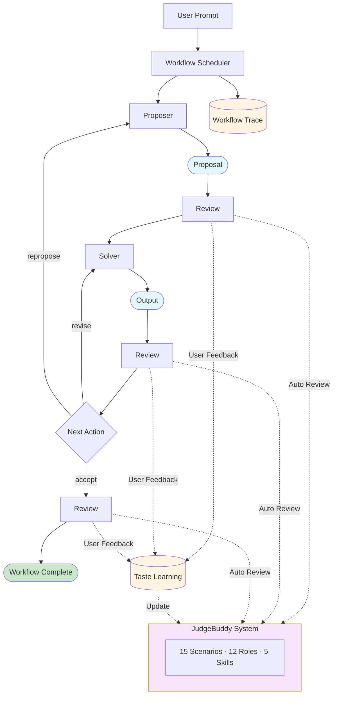
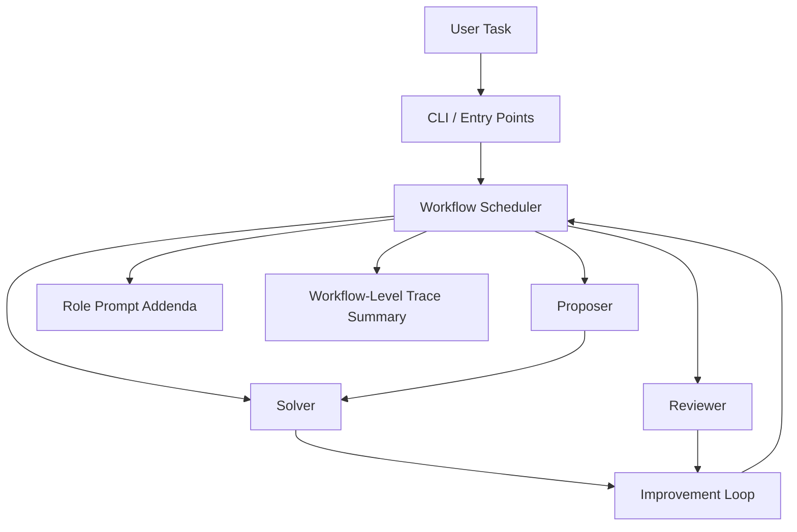
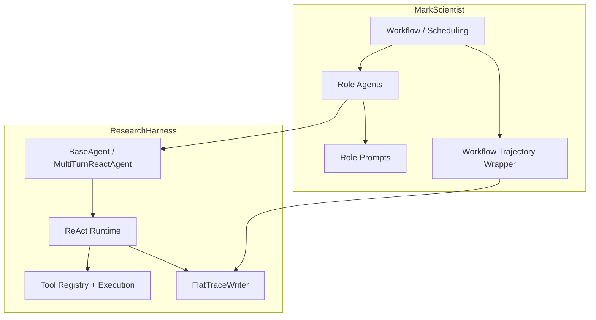

<div align="center">

# MarkScientist

**Self-evolving Research Agent with Built-in Scientific Taste**

**Proposer hypothesizes → Solver executes → Reviewer critiques → Iteration**

[](LICENSE)
[](https://www.python.org/)
[](https://github.com/black-yt/ResearchHarness)
[](#-how-it-works)
[](#-how-it-works)
[](#-architecture-boundary)

</div>

MarkScientist is a higher-layer framework for running **role-specialized agents**, **review-driven improvement loops**, and **workflow-level evaluation** on top of ResearchHarness.

## Scientific Workflow Model

The role model is inspired by the scientific method and AI Scientist workflows:



This project is intentionally centered on:

- **Role separation**: Proposer, Solver, and Reviewer with distinct responsibilities
- **Review pressure**: JudgeBuddy system with scenario-aware, role-specialized evaluation
- **Multi-mode evaluation**: Single, panel, pairwise comparison, and claim validation
- **Taste learning**: Calibrate reviewer standards through user feedback over time

---

## Table of Contents

- [Highlights](#highlights)
- [Quick Start](#quick-start)
- [How It Works](#how-it-works)
- [Architecture Boundary](#architecture-boundary)
- [Usage](#usage)
- [Reviewer Buddies](#reviewer-buddies)
- [JudgeBuddy System](#judgebuddy-system)
- [Commands](#commands)
- [Task Types](#task-types)
- [Config](#config)
- [Roadmap](#roadmap)
- [License](#license)

---

## Highlights

- **Built on ResearchHarness**
  Reuses ResearchHarness for execution; adds multi-agent roles and workflow orchestration.
- **Proposer → Solver → Reviewer**
  Three-agent workflow with iterative review-driven improvement loops.
- **JudgeBuddy system**
  15 research scenarios × 12 reviewer roles × 5 scoring skills (G-Eval, Prometheus, AlpacaEval, PandaLM, JudgeLM).
- **Multi-mode evaluation**
  Single review, panel review, pairwise comparison, and claim validation.
- **Taste learning**
  Collects user feedback to calibrate reviewer standards and develop personalized scientific taste.

### At a Glance

| Area | What MarkScientist focuses on |
| --- | --- |
| Runtime dependency | Reuses ResearchHarness for execution |
| Roles | Proposer, Solver, Reviewer |
| Review model | Score, critique, and improve |
| JudgeBuddy | 15 scenarios × 12 roles × 5 skills |
| Evaluation modes | Single, Panel, Pairwise, Claim validation |
| Trace model | Workflow summary plus per-agent traces |
| UX | Arrow-key CLI with reviewer buddies |
| Scope | Orchestration layer, not execution harness |

## Quick Start

```bash
git submodule update --init --recursive
pip install -e .
markscientist
```

`MarkScientist` currently assumes a source checkout with the `ResearchHarness` git submodule available. Wheel-only installs are not a supported standalone distribution mode unless you point `RESEARCHHARNESS_PATH` at an external checkout.

## How It Works

`MarkScientist` is not a second execution harness. It is a higher-layer framework built on top of `ResearchHarness`.



The lower-layer execution details live in `ResearchHarness`, and `MarkScientist` connects to them like this:



## Architecture Boundary

- `ResearchHarness` is the execution layer:
  - OpenAI-compatible SDK calls
  - native tool calling
  - ReAct loop
  - tool registry and execution
  - flat per-agent trace writing
- `MarkScientist` is the orchestration layer:
  - Proposer / Solver / Reviewer agent roles
  - workflow scheduling and improvement loops
  - role-specific prompt addenda
  - workflow-level trajectory summaries

`MarkScientist` agents inherit the ResearchHarness agent base instead of reimplementing the lower-layer execution stack.

## Usage

### Workflow Mode

The workflow runs **Proposer → Reviewer → Solver → Reviewer** in a loop until the final score meets the threshold.

```bash
markscientist --workflow "Write a literature review on RL for robotics"
```

#### Step 1: Proposer generates a research proposal

```
╭──────────────── Proposer Input ──────────────────╮
│  Task: "Write a literature review on RL for      │
│         robotics"                                │
╰──────────────────────────────────────────────────╯

╭──────────────── Proposer Output ─────────────────╮
│  Topic       RL for Robotics Literature Review   │
│  Hypothesis  Deep RL approaches have become the  │
│              dominant paradigm for robot control │
│  Scope       Survey methods from 2018-2024       │
│  Criteria    coverage, synthesis, organization   │
╰──────────────────────────────────────────────────╯

╭──────────────── Proposer Review ─────────────────╮
│  [•=•] EVAL-9000: "Evaluating proposal..."       │
│  Score       7.5/10                              │
│  Strengths   Clear scope, well-defined criteria  │
│  Weaknesses  Could narrow focus to specific task │
│  Verdict     ACCEPT                              │
╰──────────────────────────────────────────────────╯
```

#### Step 2: Solver executes the proposal

```
╭──────────────── Solver Input ────────────────────╮
│  Proposal: "Survey deep RL methods for robot     │
│            control from 2018-2024, covering      │
│            model-free, model-based, and sim2real │
│            approaches"                           │
│  Criteria: coverage, synthesis, organization     │
╰──────────────────────────────────────────────────╯

╭──────────────── Solver Output ───────────────────╮
│  # Literature Review: RL for Robotics            │
│  ## 1. Introduction                              │
│  Reinforcement learning has transformed...       │
│  ## 2. Model-Free Methods                        │
│  PPO, SAC, and TD3 dominate continuous control...│
│  ## 3. Model-Based Approaches                    │
│  World models enable sample-efficient learning...│
│  ## 4. Sim-to-Real Transfer                      │
│  Domain randomization and adaptation...          │
╰──────────────────────────────────────────────────╯

╭──────────────── Solver Review ───────────────────╮
│  ((•)(•)) Professor Owl: "Analyzing structure..."│
│  Score       6.8/10                              │
│  Strengths   Good organization, covers key areas │
│  Weaknesses  Missing recent 2024 references      │
│  Verdict     REVISE                              │
╰──────────────────────────────────────────────────╯
```

#### Step 3: Iteration until acceptance

```
╭──────────────── Iteration 2 Input ───────────────╮
│  Feedback: "Missing recent 2024 references"      │
│  Action:   Revise with updated citations         │
╰──────────────────────────────────────────────────╯

╭──────────────── Iteration 2 Output ──────────────╮
│  Solver revised with 2024 references added       │
│  Score       8.2/10                              │
│  Verdict     ACCEPT                              │
╰──────────────────────────────────────────────────╯

╭──────────────── Workflow Complete ───────────────╮
│  Status      Success                             │
│  Final Score 8.2/10                              │
│  Iterations  2                                   │
│  Verdict     ACCEPT                              │
╰──────────────────────────────────────────────────╯
```

### CLI Options

```bash
markscientist --workflow "task"        # Full workflow with review loop
markscientist --workflow "task" --json # JSON output for programmatic use
```

## Reviewer Buddies

| Buddy | Name | Focus |
|:-----:|------|-------|
| `((•)(•))` | Professor Owl | Methodology |
| `=•ω•=` | Dr. Whiskers | Details |
| `[•=•]` | EVAL-9000 | Metrics |
| `<•~•>` | Elder Dragon | Big Picture |
| `/• •\` | The Specter | Hidden Issues |
| `~(••)~` | Dr. Tentacle | Multi-angle |

## JudgeBuddy System

The enhanced JudgeBuddy system provides scenario-aware, role-specialized evaluation:

### Research Scenarios (15)

| Phase | Scenarios |
|-------|-----------|
| Idea Discovery | `idea_generation`, `novelty_check`, `idea_refinement` |
| Experiment | `experiment_design`, `result_analysis`, `claim_validation`, `ablation_review` |
| Paper Writing | `paper_outline`, `section_draft`, `figure_table`, `full_paper` |
| Review | `rebuttal`, `revision` |
| General | `code_review`, `literature_review` |

### Researcher Roles (12)

| Role | Focus | Buddy Species |
|------|-------|---------------|
| Senior Reviewer | Overall quality | Owl |
| Novelty Critic | Originality | Ghost |
| Methods Expert | Methodology | Robot |
| Statistics Expert | Statistical rigor | Robot |
| Writing Expert | Clarity | Cat |
| Domain Expert | Technical correctness | Dragon |
| Literature Expert | Related work | Octopus |
| Code Expert | Implementation | Robot |
| Reproducibility Advocate | Reproducibility | Cat |
| Skeptic | Finding flaws | Ghost |
| Area Chair | Meta-review | Dragon |
| Visualization Expert | Figures/tables | Octopus |

### Judge Skills (5)

| Skill | Source | Best For |
|-------|--------|----------|
| G-Eval | DeepEval | Multi-dimensional CoT scoring |
| Prometheus | prometheus-eval | Custom rubric evaluation |
| Pairwise | AlpacaEval | Head-to-head comparison |
| PandaLM | PandaLM | Reproducible eval with reference |
| JudgeLM | JudgeLM (ICLR 2025) | Bias-mitigated scalable judging |

### Usage

```python
from markscientist.agents import ReviewerAgent
from markscientist.buddy import ResearchScenario, ResearcherRole, JudgeSkill

reviewer = ReviewerAgent(config=config)

# Single review with specific configuration
review = reviewer.review_with_buddy(
    artifact=code,
    scenario=ResearchScenario.CODE_REVIEW,
    role=ResearcherRole.CODE_EXPERT,
    skill=JudgeSkill.GEVAL,
)

# Panel review with multiple judges
panel_result = reviewer.review_with_panel(
    artifact=paper_draft,
    scenario=ResearchScenario.FULL_PAPER,
    num_judges=3,
)

# Pairwise comparison
comparison = reviewer.compare_artifacts(
    artifact_a=version1,
    artifact_b=version2,
    scenario=ResearchScenario.SECTION_DRAFT,
)

# Claim validation
validation = reviewer.validate_claims(
    claims=["Method X improves accuracy by 10%", "Approach is O(n)"],
    evidence=experiment_results,
)
```

## Commands

```
/help        Show commands        /workflow    Full pipeline
/solver      Solver mode          /review      Toggle auto-review
/model       Switch model         /config      Show config
/clear       New session          /exit        Exit REPL

JudgeBuddy commands:
/judge       Review with JudgeBuddy (scenario:role:skill -- content)
/panel       Multi-judge panel review
/compare     Pairwise comparison (scenario -- A ||| B)
/scenarios   List all research scenarios
/roles       List all researcher roles
/skills      List all judge skills
```

## Task Types

| Type | Scoring Dimensions |
|------|-------------------|
| `factual_query` | accuracy, completeness, clarity |
| `idea_proposal` | novelty, rigor, feasibility |
| `code_analysis` | correctness, depth, clarity |
| `literature_review` | coverage, synthesis, organization |
| `experiment_design` | methodology, validity, reproducibility |
| `writing_draft` | structure, clarity, coherence |
| `data_analysis` | accuracy, interpretation, visualization |
| `problem_solving` | correctness, efficiency, explanation |

## Config

```bash
# .env
API_KEY=your-key
API_BASE=https://your-openai-compatible-endpoint/v1
MODEL_NAME=gpt-5.4
RESEARCHHARNESS_PATH=./vendor/ResearchHarness
```

If you need a non-default `ResearchHarness` checkout programmatically, call `set_config(config)` before importing `markscientist.agents`.

## Roadmap

- [x] v0.1 — Three agents (Proposer, Solver, Reviewer), multi-type review, Buddies
- [x] v0.2 — JudgeBuddy system (scenarios, roles, skills), panel review, claim validation
- [x] v0.2 — Arrow-key CLI interaction, pairwise comparison
- [ ] v0.3 — Taste learning from user feedback
- [ ] v0.3 — Workflow optimization with adaptive scoring
- [ ] v1.0 — Stronger workflow policies, richer evaluation, better high-level testing

## License

This project is released under the [MIT License](LICENSE).
